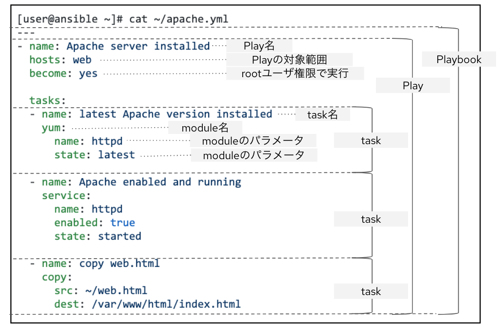

# パブリッククラウドでの環境準備

## 0.はじめに

今回作るAnsible環境を継続して利用したい方や、自身の環境に対して実行したい方にお勧めの方法です。
こちらの方法では、環境によってインストールや設定が必要となりますが、Ansibleのインストールや初期設定についても理解を深めることができます。
まず、Ansibleは、Python 2 (2. 7以上) or Python 3(3.5以上）の搭載された環境にて動作します。
そのため RHELをはじめとするLinux、BSDやmacOSなどにインストールできます。
なお、Ansible バージョン2.9の時点では、Control Nodeとして **WindowsはAnsibleインストールすることができません** 。

以下ではパブリッククラウドでの準備と、サーバやご自身のマシンに環境を準備する場合のご説明をいたします。


## 1. 環境準備

### 1.1. パブリッククラウドでの準備

パブリッククラウドで環境を用意する場合には、Control Node用のインスタンスイメージとしてx86_64のRHEL8などを選択してください。
また、初期学習用としては、Target NodeにもAnsibleにおいて基本となるLinuxのうちRHEL8やCentOS8などを選ぶと良いでしょう。
動作の説明で記載した通り、AnsibleではSSHやSFTPなどのプロトコルを使用してControl NodeからTarget Nodeを管理・操作します。
パブリッククラウドのネットワークとセキュリティの設定にて、これらの通信が可能となるよう設定してください。
また、学習用にTarget Nodeを複数用意する場合には、Ansibleからのアクセス用IDとパスワード/rootアカウントのパスワードをTarget Node間で共通させておくことをお勧めします。

### 1.2. プライベート環境での準備

サーバーやご自身の環境にて用意する場合には、Control Node用のインスタンスイメージとしてx86_64のLinux系OSや、macOSなどを選択してください。
また、初期学習用として後続のコンテンツをご利用頂く場合には、Target Nodeをご用意頂くことをお勧めします。
ご用意される場合には、Ansibleにおいて基本となるLinuxのうちRHEL8やCentOS8などを選ぶと良いでしょう。
また、Ansibleによる操作を実施するには、Control NodeとTarget Node間がSSHやSFTPなどで疎通可能なことが求められます。
次の項目に進む前に合わせてネットワーク設定を確認ください。

## 2. Control Nodeへ Ansibleをインストールする

### 2.1 RHEL 8 / CentOS 8へのAnsibleインストール

次に、Control Node用のインスタンスにAnsibleをインストールしましょう。
RHEL 8 / CentOS 8 の場合には下記のコマンドでインストールを実施できます。

```
$ sudo yum install ansible
```

### 2.2 その他の環境へのAnsibleインストール

上記以外のOSに対してインストール場合には方法が異なります。
お使いの環境に合わせて、下記を参考にAnsibleのインストールを実施してください。

https://docs.ansible.com/ansible/latest/installation_guide/intro_installation.html

また、次に紹介する演習を実施するために、Target Node用としてRHELやCentOSなど、適切なマシンを用意してください。


## 3.演習
本演習は、Control Node / Target Node ともにRHEL8 / CentOS8をベースに記載しています。
他のOSで実施する場合には、操作方法や利用するモジュールが異なることがありますので、予めご了承ください。

### 3.1 Ansibleのバージョンを確認する

まずはじめに、Control NodeにインストールされているAnsibleのバージョンを確認しましょう。
下記のような出力となります。
※実行できない場合には、Ansibleが正しくインストールできていない可能性があります。

```
[root@ansible ~]# ansible --version
ansible 2.9.9
[...]
```


### 3.2 インベントリを作成する

次に、inventory ファイルを作成しましょう。
Ansibleにおいて、Inventoryファイルは対象を示していて実行に欠かせない要素です。
下記に簡単なInventoryの例を示します。皆さんの環境でも試してみてください。

```
[user@ansible ~]# cat ~/inventory/hosts
[all:vars]
ansible_user=USER_NAME
ansible_ssh_pass=PASSWORD
ansible_become_user=ROOT_USER_NAME
ansible_become_pass=ROOT_PASSWORD
ansible_port=22

[web]
node1 ansible_host=X.X.X.X
node2 ansible_host=Y.Y.Y.Y
node3 ansible_host=Z.Z.Z.Z

[control]
ansible ansible_host=A.A.A.A
```

#### 解説

- ここではファイルの名前をhostsとしていますが、任意の名前・任意のディレクトリで問題ありません。なお、大文字の箇所は環境に合わせて任意の値に書き換えてください。
- ここではTarget Nodeとしてnode 1〜3の3台を用意しています。直前に記載されたwebは、node1~3を纏めたグループの名称です。
- [control]にあるansibleというノードは、Control Node自体を指しています。
- [all:vars]には、このInventoryファイル全体に共通する変数を定義しています。
- ansible _userは、通常アクセス時のユーザー名を指します。
- ansible_ssh_passは、通常アクセス時のユーザーパスワードを指します。
- ansible_become_userは、スーパーユーザーのユーザー名を指します。
- ansible_become_passは、スーパーユーザーのパスワードを指します。
- ansible_portは、Ansibleのアクセスに利用するSSHのポート番号22を示しています。


### 3.3 Ping a Host

次に、inventoryの設定とTarget Nodeの設定が正しいことを確かめるために、Pingモジュールだけを実行します。
コマンドと実行結果は下記のようになるはずです。

```
[user@ansible ~]$ ansible -i ~/inventory/hosts web -m ping
node2 | SUCCESS => {
    "ansible_facts": {
        "discovered_interpreter_python": "/usr/bin/python"
    },
    "changed": false,
    "ping": "pong"
}
[...]
```

#### 解説

- このPingは、ネットワークで使われるpingコマンドではなく、Ansibleのping モジュールを指します。
- AnsibleのPingは、対象環境に接続を試みてAnsibleの処理を実行するためのPython環境が整っているかを確認するために使用され、引数なしで利用できます。
- 今回のコマンドでは、ansibleコマンドを用いてhostsインベントリの中のWebグループに対し、-mで指定されたpingモジュールによる処理を実施しました。
- また、このように特定のモジュール単体を指定して実行する方法をAnsibleではAd-hoc実行と言います。

Ansible Projectで管理されているModuleのリファレンスは、下記のようにWebなどで確認できます。
https://docs.ansible.com/ansible/latest/modules/ping_module.html#ping-module
https://docs.ansible.com/ansible/latest/modules/modules_by_category.html


# 3.4 はじめてのPlaybook

Ansibleのアドホックコマンドは単純なオペレーションの際にはとても役立ちますが、複雑な構成管理やオーケストレーションのシナリオには適していません。そのようなユースケースの時には、Playbookを用いてみると良いでしょう。

Playbook（プレイブック）は、管理対象に対して実装したいこうなってほしいという構成や手順を記述したファイルです。
Playbookを用いることで、長く複雑な管理タスク群を、成功が予測される状態で、簡単にいつでも再現できるルーチンへと変えることができます。
playbookは先ほど実行していたアドホックコマンドを複数取り込み、 複数のtask のセットとして利用することができるようになります。
Playbookは、1つもしくは複数のTaskを持ちます。Taskではmoduleが指定されて実行されます。

まず、下記にある簡単なPlaybookを例に内容を理解してみましょう。
```
[user@ansible ~]# cat ~/apache.yml
---
- name: Apache server installed
  hosts: web
  become: yes

  tasks:
  - name: latest Apache version installed
    yum:
      name: httpd
      state: latest

  - name: Apache enabled and running
    service:
      name: httpd
      enabled: true
      state: started

  - name: copy web.html
    copy:
      src: ~/web.html
      dest: /var/www/html/index.html
```

前述の用語と対比させると、このPlaybookの構成は、下記のようになっています。




上から順番に、Playbookの内容について確認していきましょう。

```
---
- name: Apache server installed
  hosts: web
  become: yes

  tasks:
```
#### 解説
- 1行目の --- は、Playbookの始まりを意味しています。YAMLにおける形式の区切りという意味もあるため、Playbookを書く際には入れるように心がけてください。
- 2行目のname: 〜は、このPlaybook（Play）がどんなPlaybook（Play）かを示すための任意の名前です。
- 3行目の hosts: web は、このPlaybook（Play）は、Inventoryの中のWebグループに対して実行すると示しています。
- 4行目のbecome: yes は、このPlaybook（Play）をrootユーザーで実行することを示しています。
- 6行目のtasks: の中には、このPlaybook（Play）で実行されるtaskを定義していきます。
- ここで、tasks後の行は、インデント（行頭の空白による字下げ）が入っていることに注目してください。このインデントは、以降の要素がtasksの子要素や孫要素となっていることを意味しています。
- AnsibleのPlaybookでは、インデントによって横並びの要素なのか子要素なのかを表現します。
- **インデントには半角スペースのみを使用し、タブや全角スペースを使わないよう注意してください。**
- **1つのPlaybookファイルにおいて異なる数のインデントを混ぜないよう注意してください。**


このPlaybookのtasksには、3つのtaskが入っています。
1つ目のTaskを確認していきましょう。
```  
  - name: latest Apache version installed
    yum:
      name: httpd
      state: latest
```

#### 解説

- このタスクの最初の行は、Playbook（Play）でのnameと同じく、このTaskが何をするのかを示した名前となっています。
- 次の yum: が、このTaskで指定されたModuleです。今回はRHELにおいてパッケージの管理を行うyumモジュールが指定されています。
- Yumに続く2行は、インデントが下がっているためyumの子要素であることがわかります。これらはyumモジュールのパラメータとなっていて、httpdパッケージをlatestでインストールした状態にするという指示が記載されています。
	
  なお、yumモジュールの詳しいリファレンスは下記を参照してください。
	https://docs.ansible.com/ansible/latest/modules/yum_module.html#yum-module


2つ目のタスクは、サービスの起動状態や再起動時の動作などを定義できるserviceモジュールを使用しています。

```
  - name: Apache enabled and running
    service:
      name: httpd
      enabled: true
      state: started
```

#### 解説
- このTaskでは、3つのパラメータが定義されていて、前のタスクでインストールした状態としたhttpdを起動状態とし、再起動後にも起動する設定となるよう指示しています。
	
  Serviceモジュールの詳しいリファレンスは、下記を参照してください。
	https://docs.ansible.com/ansible/latest/modules/service_module.html#service-module
	
3つ目のタスクは、Control Node からTarget Nodeへファイルのコピーを行うモジュールです。
  
```
  - name: copy web.html
    copy:
      src: ~/web.html
      dest: /var/www/html/index.html
```

#### 解説
- 今回は、Control Nodeにある~/web.htmlというファイルを、Target Nodeの/var/html/index.htmlへコピーされた状態とする、と指示しています。

  Copyモジュールの詳しいリファレンスは、下記を参照してください。
	https://docs.ansible.com/ansible/latest/modules/copy_module.html#copy-module

	なお、~/web.htmlの内容として下記のようなものをご用意ください。
  
```
<body>
<h1>Apache is running fine</h1>
</body>
```

### 3.5 Playbookの実行

Ansibleでplaybookを実行する場合には、ansible-playbookコマンドを用いて、下記のように実行します。

```
[user@ansible ~]# ansible-playbook -i ~/inventory/hosts apache.yml
```

この実行結果では、何もエラーが出ず最後にPlay Recapとして実行した各ノードの結果が表示されるはずです。

ここまでの記述と実行から、Ansibleではプログラムのような現状の把握と状況に合わせた処理を記述することはなく、在るべき姿のみを簡潔に記述できることがご理解頂けたのではないかと思います。

ここまでできた方は、もう一度上のansible-playbookコマンドの実行を試してください。2回目の実行においてもエラーは出ず成功して終わりますが、1回目と比べて、結果の表示が異なっている事に気づくと思います。


1度目の実行では Recapにて、okとchangedの両方にカウントが入っていたのに対し、2度目はokのみにカウントが入っています。

Ansibleのほとんどのモジュールでは、各Taskの実行の前に対象の状態が求める状態（在るべき状態）と同じかどうかを確認し、在るべき状態でなければ適した処理を実施する/在るべき状態なら新たな処理をしないように設計されています。そのため、既に設定済みや新規で設定するNode、途中まで設定したNodeを混ぜて実行し、それぞれに合わせた処理を行った上で同じ状態に揃えることができます。
