# 環境を準備する

本ドキュメントは [Ansible Trail Map 牡丹山](https://www.redhat.com/ja/explore/ansible/trailmap) の一部となります。
Red Hat Ansible Automation Platform の環境を構築し、自動化のボタン化の準備を整えます。ここで構築する環境は体験とデモを目的としておりますので、本番の自動化環境としては利用しないでください。

## 進め方の概要

1. [必要な環境](#必要な環境)
1. [Red Hat Customer Portal のアカウントを作成する](#Red-Hat-Customer-Portal-のアカウントを作成する)
1. [Red Hat Enterprise Linux(以下RHEL) と Red Hat Ansible Automation Platform の試用サブスクリプションを取得する](#試用サブスクリプションを取得する)
1. [RHELをインストールする](#RHELのインストール)
1. [Red Hat Ansible Automation Platform をインストールする](#Red-Hat-Ansible-Automation-Platform-のインストール)
1. [動作確認](#動作確認)

## 必要な環境

ここでは仮想環境の中で Red Hat Ansible Automation Platform を構築します。下記を確認し仮想環境は自分の環境に適したものを選択してください。

- 仮想マシンを起動できるノートPCやサーバー
  - x86_64アーキテクチャ
  - VirtualBox, VMware, KVM, Hyper-V 等

- 仮想マシンの必要スペック
  - vCPU: 2core以上
  - 仮想メモリー: 8GB以上
  - 仮想ディスク: 20GB以上
  - インターネットへの接続が可能なこと

- その他の必要物
  - Red Hat Customer Portal のアカウントを作成するためのメールアドレス


## Red Hat Customer Portal のアカウントを作成する

まず Red Hat Customer Portal のアカウントを作成します。このアカウントに必要な試用サブスクリプションを関連付けて環境を構築します。

作成方法に関しては [こちら](https://jp-redhat.com/pdf/Create_newID_and_subuser.pdf) を参照してください。作成にはメールアドレスが必要となります。


## 試用サブスクリプションを取得する

次に作成したアカウントで試用版のサブスクリプションを取得します。以下のサイトから簡単に取得することが可能です。手続きの途中でログインを求められる場合がありますので、先程作成した Red Hat Customer Portal のアカウントを入力してください。

- [RHELの試用サブスクリプションを取得する](https://www.redhat.com/ja/technologies/linux-platforms/enterprise-linux/try-it?sc_cid=7013a000002vp2NAAQ){:target="_blank"}
- [Red Hat Ansible Automation Platform の試用サブスクリプションを取得する](https://www.redhat.com/ja/technologies/management/ansible/try-it?sc_cid=7013a000002vp2NAAQ){:target="_blank"}

### RHELの試用サブスクリプションの取得

#### STEP1
こちらの[リンク](https://www.redhat.com/ja/technologies/linux-platforms/enterprise-linux/try-it?sc_cid=7013a000002vp2NAAQ){:target="_blank"}を開いて、「START YOUR TRIAL」をクリックします。

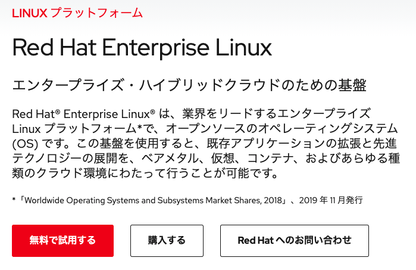


#### STEP2
ログインが求めらた場合は、先程作成した Red Hat Customer Portal のアカウントでログインしてください。その後、ライセンスへの同意を求められますので内容を確認してから同意すると試用サブスクリプションが取得できます。

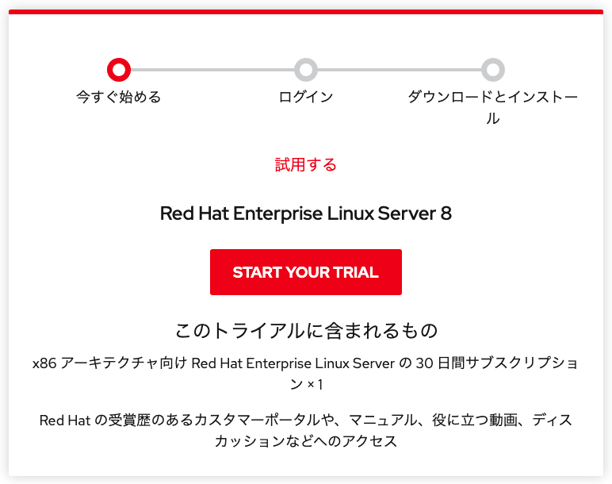

#### STEP3
取得に成功するとインストールメディアのダウンロードが始まります。始まらない場合はリンクをクリックしてインストールメディアを取得しましょう。

> Note: ここでダウンロードされるRHELのインストールメディアの容量は8GB前後になるため、モバイル回線を使用している方は注意してください。

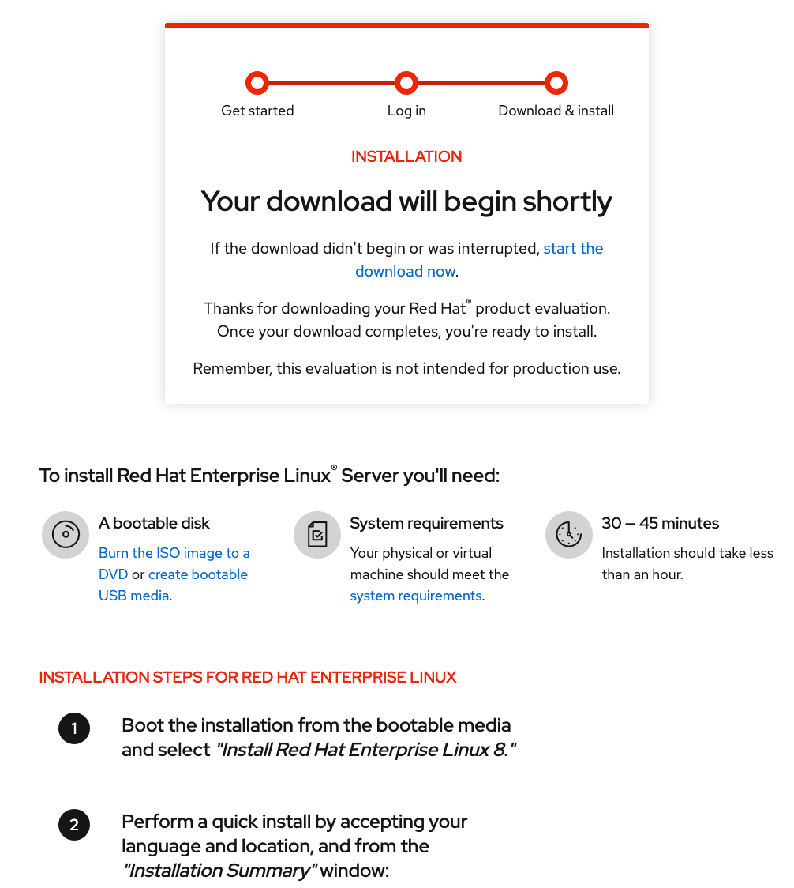

2021/2/14時点では以下のファイルがダウンロードされます。後続のインストール手順の中で利用します。

RHELのインストールメディア
```
rhel-8.3-x86_64-dvd.iso
```

### Red Hat Ansible Automation Platfromの試用サブスクリプションの取得

#### STEP1
こちらの[リンク](https://www.redhat.com/ja/technologies/management/ansible/try-it?sc_cid=7013a000002vp2NAAQ){:target="_blank"}を開いて、「START YOUR TRIAL」をクリックします。

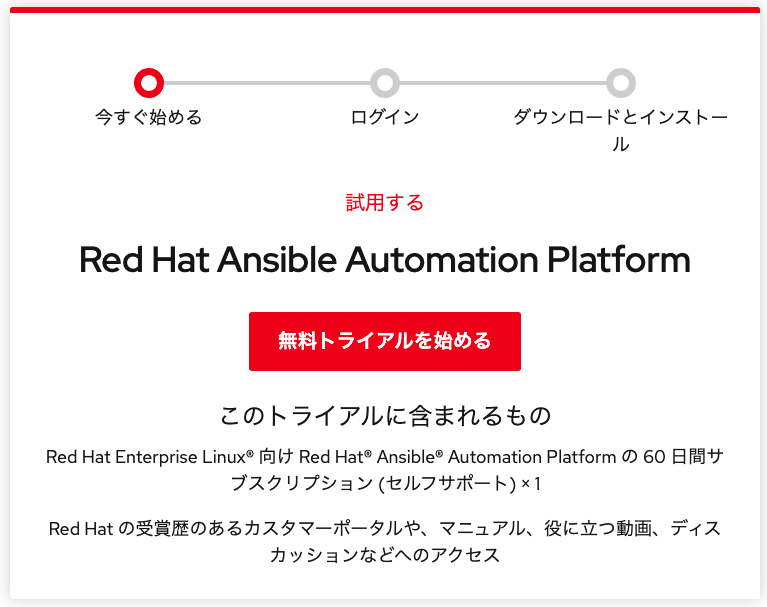

#### STEP2
ログインが求めらた場合は、先程作成した Red Hat Customer Portal のアカウントでログインしてください。その後、ライセンスへの同意を求められますので内容を確認してから同意すると試用サブスクリプションが取得できます。


#### STEP3
取得に成功するとインストールメディアのダウンロードが始まります。始まらない場合はリンクをクリックしてインストールメディアを取得しましょう。

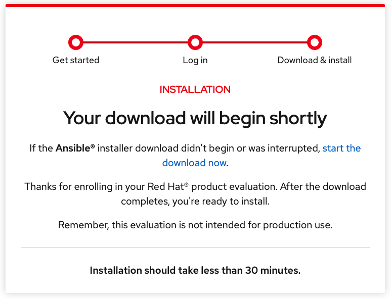

2021/2/14時点では以下のファイルがダウンロードされます。後続のインストール手順の中で利用します。

Red Hat Ansible Automation Platform のインストールファイル
```
ansible-automation-platform-setup-bundle-1.2.1-1.tar.gz
```

### 取得したサブスクリプションの確認
取得した試用版は Red Hat Customer Portal から確認することができます。以下の例ではRHELの試用サブスクリプションが割り当てられています。Red Hat Ansible Automation Platfrom も取得するとここに表示されます。


## RHELのインストール

お使いのハイパーバイザーに合わせて仮想マシンを作成し、ダウンロードしたインストールメディアから起動するように設定してください。仮想マシンを起動するとインストーラーが起動します。

### STEP1
はじめに言語を選択します。

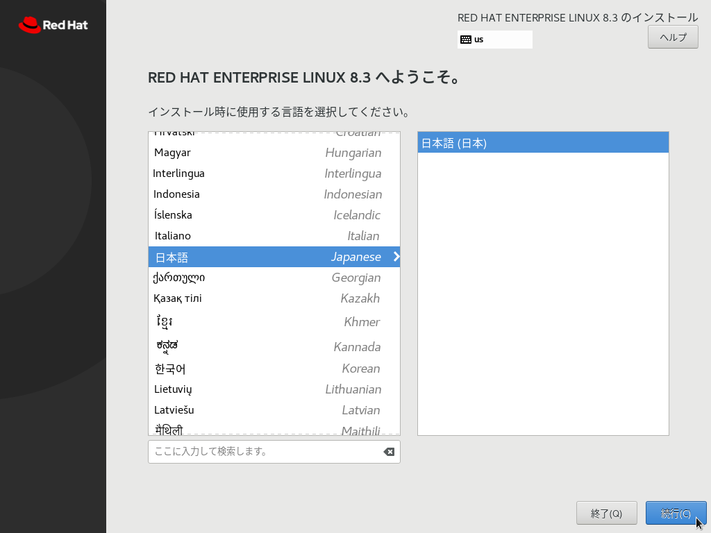

### STEP2
インストール設定を行います。

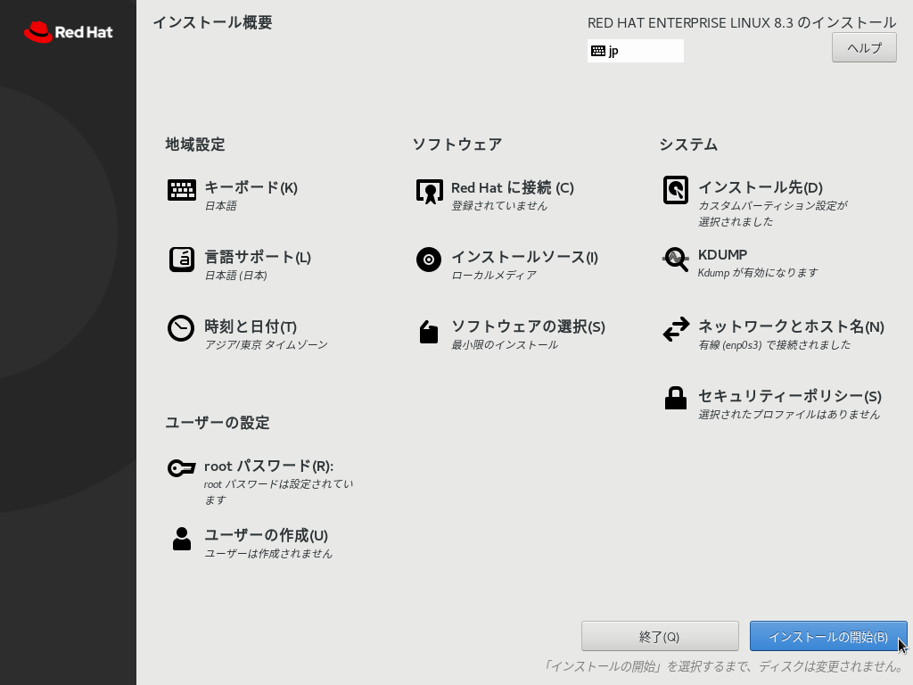

### STEP3
ネットワークを有効化します。

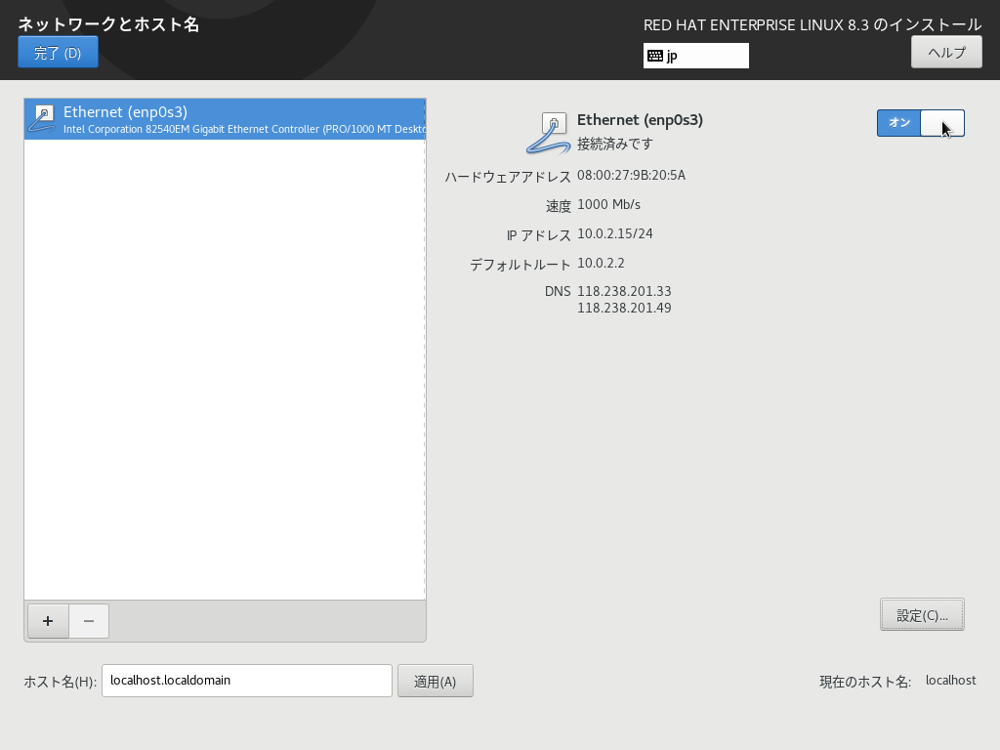

### STEP4
タイムゾーンを設定します。

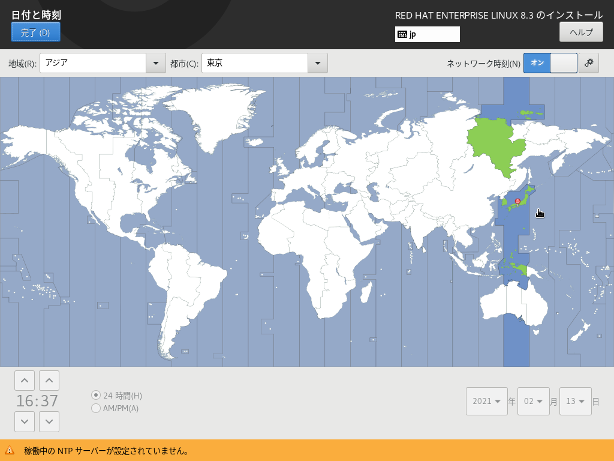

### STEP5
ディスクの設定を行います。まず「カスタム」を選択し「完了」をクリックします。

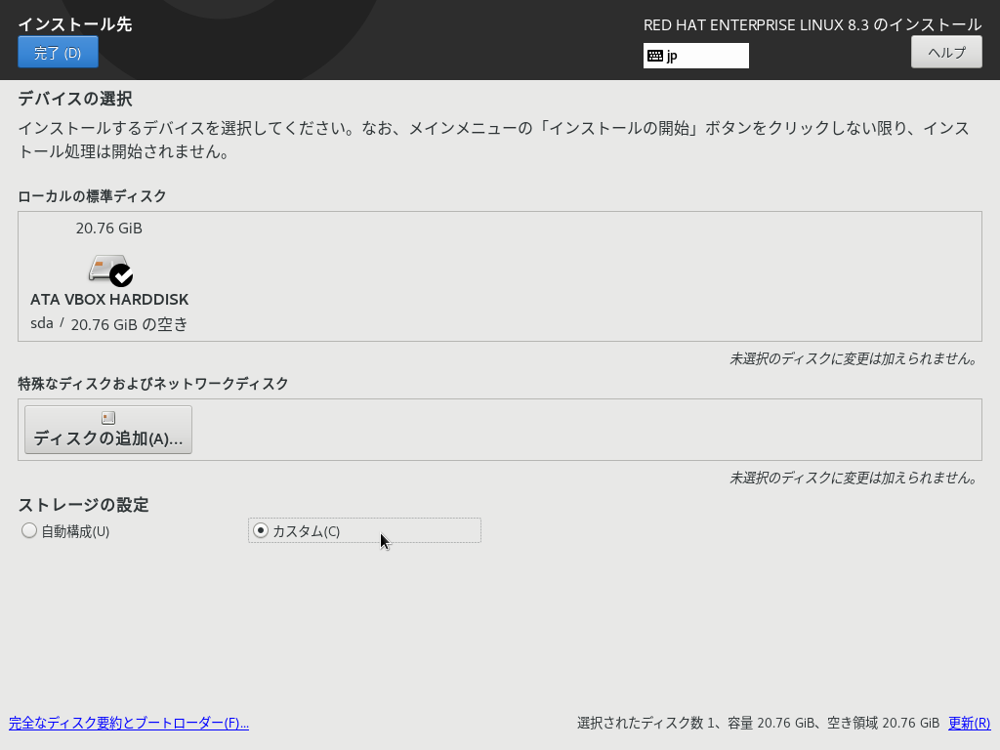

### STEP6
パーティション作成で「LVM」を選択して「ここをクリックすると自動的に作成します」をクリックします。

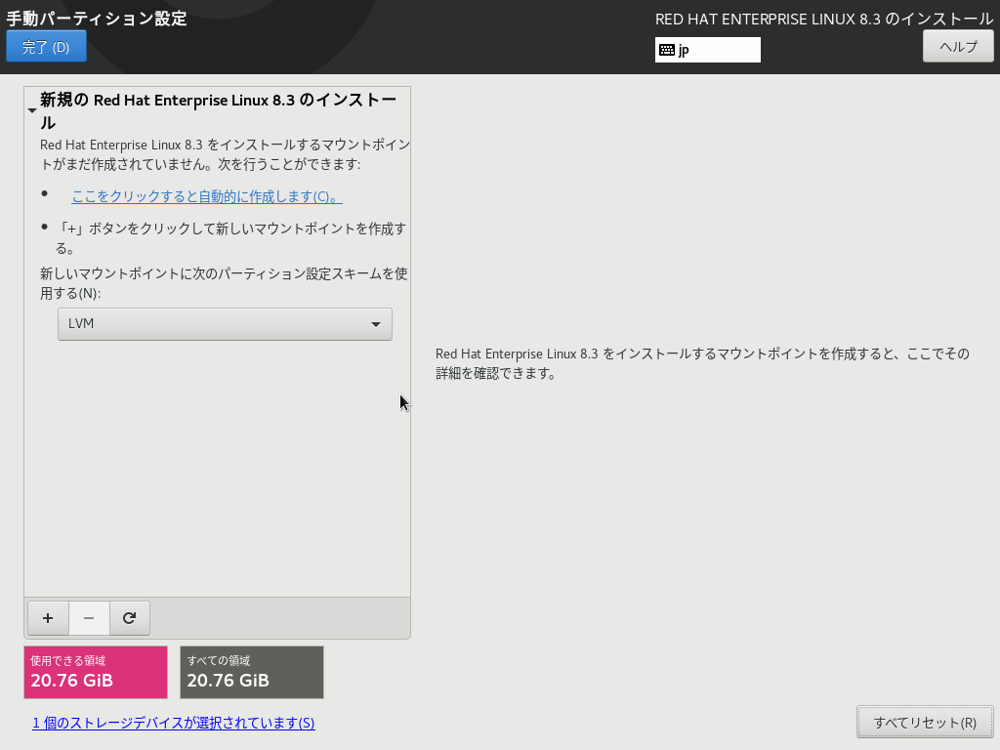

### STEP7
パーティションが作成されます。「/boot」「swap」「/」が配置されることを確認します。もし異なるレイアウトになった場合は以下の画像のように調整してください。確認・調整したら「完了」をクリックします。

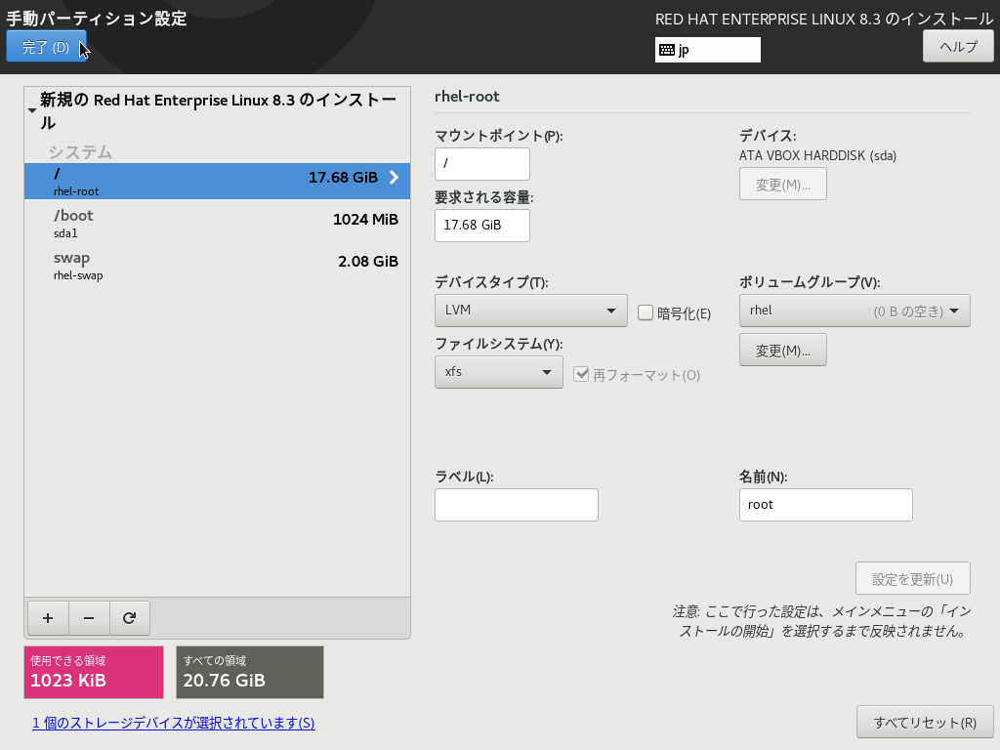

### STEP8
ソフトウェアの選択では「最小限のインストール」を選択します。

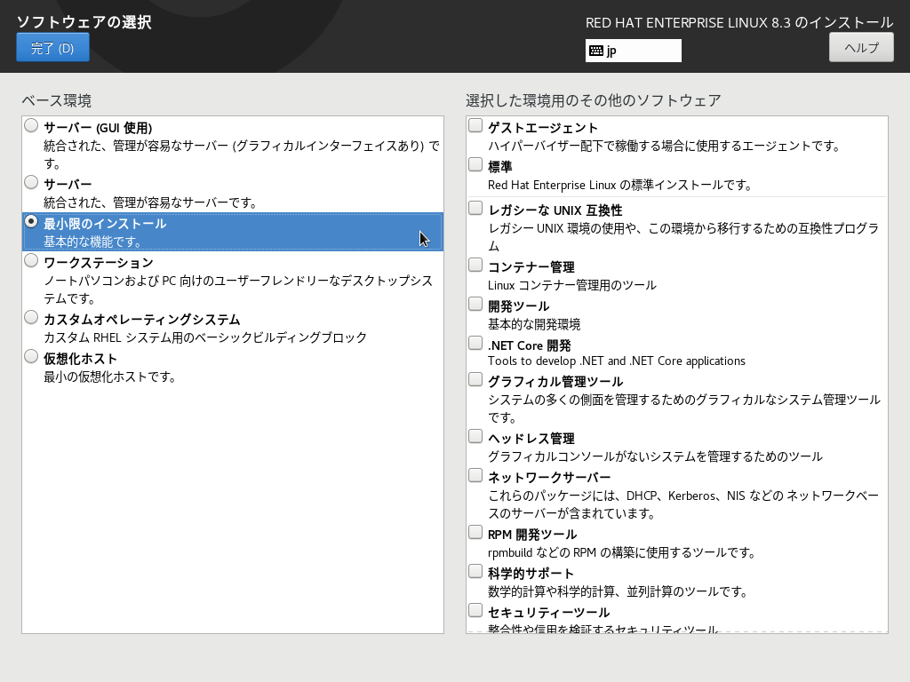

### STEP9
最後に root ユーザーのパスワードを設定し、インストールを開始してください。

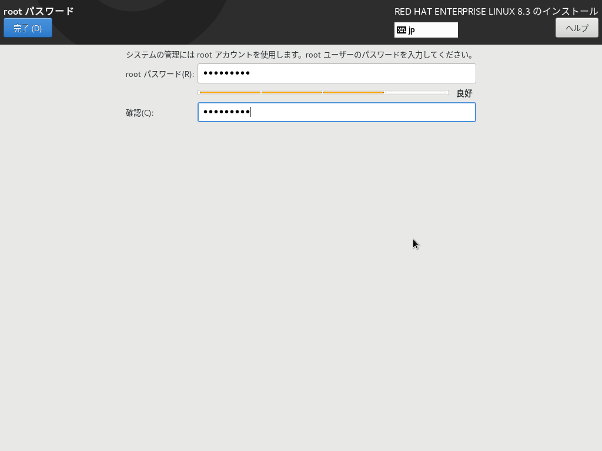

### STEP10
インストールが終了したら仮想マシンが再起動されます。ログイン可能な状態になったら root ユーザーでログインしてください。

### STEP11
インストールしたRHELに試用サブスクリプションを関連付けます。まず以下のコマンドを実行してCustomer PortalとRHELを接続します。xxxx, yyyy の部分にはCustomer Portalのユーザー名とパスワードを指定してください。
```bash
[root@localhost ~]# subscription-manager register --username='xxxx' --password='yyyy'
登録中: subscription.rhsm.redhat.com:443/subscription
このシステムは、次の ID で登録されました: xxxxx-yyyy-zzzz-aaaa-bbbbbbbbbb
登録したシステム名: localhost.localdomain
```

利用可能なサブスクリプションを表示します。試用サブスクリプションが確認できるはずです。ここでプールIDをメモしておきます。
```bash
[root@localhost ~]# subscription-manager list --available
+-------------------------------------------+
    利用可能なサブスクリプション
+-------------------------------------------+
サブスクリプション名:     30 Day Red Hat Enterprise Linux Server Self-Supported Evaluation
提供:                     Red Hat Beta
                          Oracle Java (for RHEL Server)
                          Red Hat Enterprise Linux Server
                          Red Hat CodeReady Linux Builder for x86_64
                          Red Hat Enterprise Linux for x86_64
                          Red Hat Ansible Engine
                          Red Hat Container Images Beta
                          Red Hat Enterprise Linux Atomic Host Beta
                          Red Hat Enterprise Linux Atomic Host
                          Red Hat Container Images
SKU:                      RH00065
契約:                     xxxxxxxxx
プール ID:                2c92808177826aeb017785db02f108ce ← このIDをメモしておきます。
管理の提供:               いいえ
数量:                     2
推奨:                     1
サービスタイプ:           L1-L3
ロール:                   Red Hat Enterprise Linux Server
サービスレベル:           Self-Support
使用方法:                 Development/Test
アドオン:
サブスクリプションタイプ: Instance Based
開始:                     2021年02月09日
終了:                     2021年03月11日
エンタイトルメントタイプ: 物理
```

先程のプールIDを指定してこのRHELと試用サブスクリプションを関連付けます。サブスクリプションと関連付けられたRHELはパッケージリポジトリへアクセス可能になり、dnf(yum)コマンドを利用してパッケージの操作ができるようになります。
```bash
[root@localhost ~]# subscription-manager attach --pool='2c92808177826aeb017785db02f108ce'
サブスクリプションが正しく割り当てられました: 30 Day Red Hat Enterprise Linux Server Self-Supported Evaluation
```

ためしに tar コマンドをインストールしてみましょう（最小インストールではインストールされません）。このコマンドが成功すれば設定はうまくいっています。
```
[root@localhost ~]# dnf install -y tar
```

## Red Hat Ansible Automation Platform のインストール
ここからは Red Hat Ansible Automation Platform のインストールを行います。

### STEP1
インストールファイルの `ansible-automation-platform-setup-bundle-1.2.1-1.tar.gz` をサーバーにコピーし、ファイルを展開します。以下は /root へコピーしたあとの操作です。

```
[root@localhost ~]# tar zxvf ansible-automation-platform-setup-bundle-1.2.1-1.tar.gz
[root@localhost ~]# cd ansible-automation-platform-setup-bundle-1.2.1-1
[root@localhost ansible-automation-platform-setup-bundle-1.2.1-1]# ls
README.md  backup.yml  bundle  collections  group_vars  install.yml  inventory  licenses  rekey.yml  restore.yml  roles  setup.sh
```

### STEP2
インストーラーの設定ファイル `inventory` を編集します。

```
[root@localhost ansible-automation-platform-setup-bundle-1.2.1-1]# vi inventory
```

以下のように編集します。設定する場所は `admin_password` `pg_password` になります。ここにパスワードを入力します。このパスワードは起動した Red Hat Ansible Automation Platform のログインに使用します。
```
[tower]
localhost ansible_connection=local

[automationhub]

[database]

[all:vars]
admin_password='pass-ansible-tower'

pg_host=''
pg_port=''

pg_database='awx'
pg_username='awx'
pg_password='pass-ansible-tower'
pg_sslmode='prefer'  # set to 'verify-full' for client-side enforced SSL
```

### STEP3
インストールを開始します。成功すると最後に `successfully` と表示されます。

```
[root@localhost ansible-automation-platform-setup-bundle-1.2.1-1]# ./setup.sh

[warn] Will install bundled Ansible
Updating Subscription Management repositories.
メタデータの期限切れの最終確認: 0:42:38 時間前の 2021年02月14日 21時39分58秒 に実施しました。
依存関係が解決しました。
========================================================================================================================================
 パッケージ                        アーキテクチャー    バージョン                   リポジトリー                                  サイズ
========================================================================================================================================
インストール:
 ansible                           noarch              2.9.15-1.el8ae               @commandline                                   17 M
 sshpass                           x86_64              1.06-3.el8ae                 @commandline                                   27 k
(省略)
 
PLAY RECAP *****************************************************************************************************************************
localhost                  : ok=176  changed=76   unreachable=0    failed=0    skipped=85   rescued=0    ignored=2

The setup process completed successfully.
Setup log saved to /var/log/tower/setup-2021-02-14-22:39:03.log.
```

> Note: インストール中に以下のエラーが出た場合

```
TASK [postgres : Make sure PostgreSQL is started] **************************************************************************************
fatal: [localhost]: FAILED! => {"changed": false, "msg": "Unable to start service postgresql: Job for postgresql.service failed because the control process exited with error code.\nSee \"systemctl status postgresql.service\" and \"journalctl -xe\" for details.\n"}
```

下記のコマンドを実行して不足のパッケージを導入し、その後 `./setup.sh` を再び実行してください。
```
[root@localhost ansible-automation-platform-setup-bundle-1.2.1-1]# dnf install glibc-langpack-en
```

### STEP4
インストールが完了したらブラウザでサーバーのIPアドレスへアクセスします。ログイン画面が表示されます。ユーザー名は「admin」、パスワードは先程 `inventory` ファイルに設定したものになります。


### STEP5
初回ログインを行うとサブスクリプションの設定画面が表示されます。この右側のユーザー名、パスワードの部分に Customer Portal のログイン情報を入力して「サブスクリプションの取得」をクリックします。

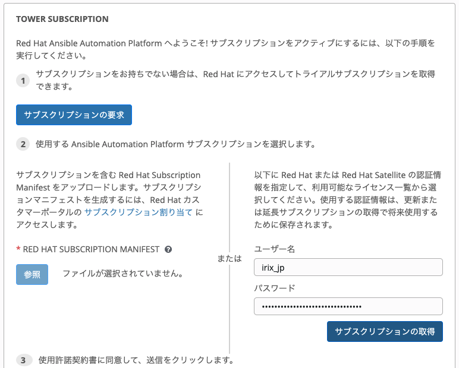

### STEP6
入力したCustomer Portalのアカウントに関連した Red Hat Ansible Automation Platform のサブスクリプションが表示されますので、試用サブスクリプションを選択します。

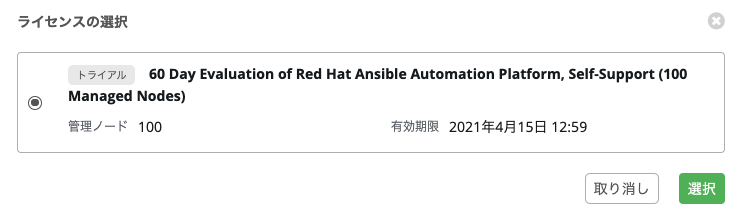


### STEP7
サブスクリプションの設定画面を終了すると、Tower の初期画面が表示されます。これでインストールは完了となります。

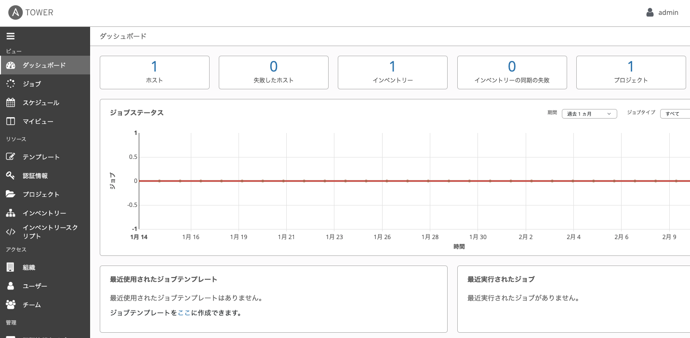

## 動作確認
最後に簡単な動作確認を行います。Towerではデモ用のジョブが作成されていますので、これを動かしてみます。

このデモジョブの動作の概要は以下です。
- Tower サーバー自身対して
- https://github.com/ansible/ansible-tower-samples の `hello_world.yml` を実行する

### STEP1
左メニューの「テンプレート」を選択し、「Demo Job Template」の右側の「ロケット」アイコンをクリックします。これでジョブが起動できます。

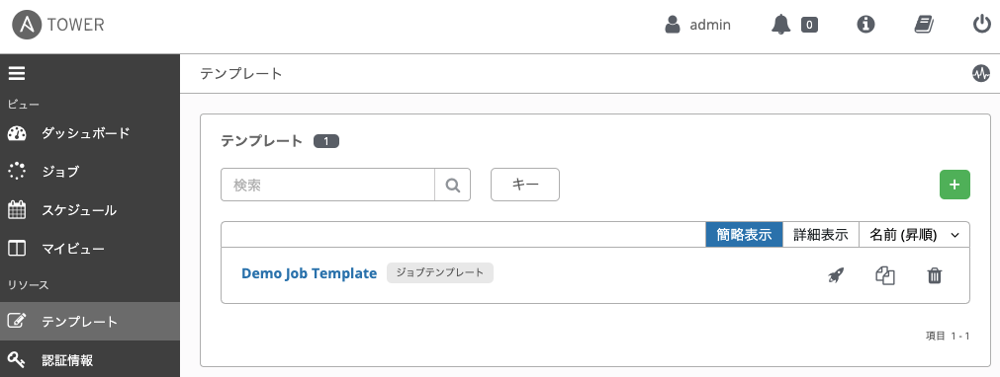

### STEP2
ジョブが起動すると実行結果が表示されます。これが完了すればセットアップは成功です！

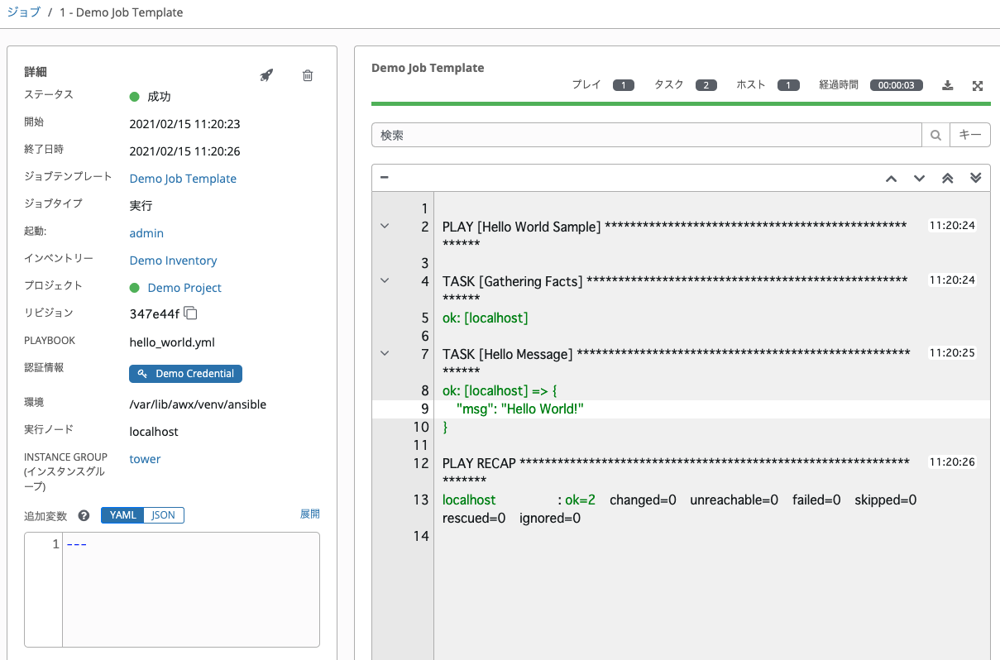
