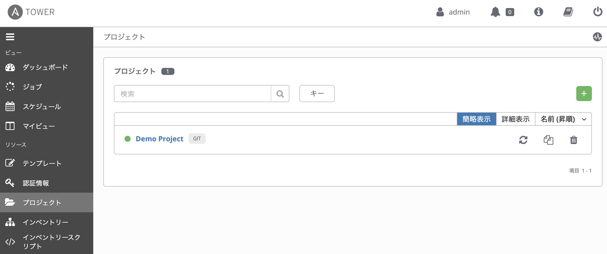
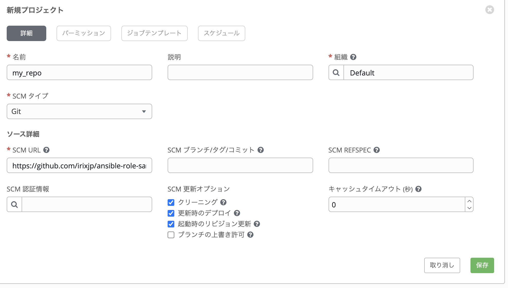
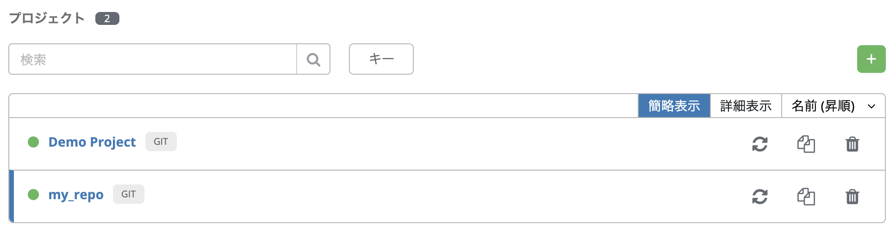
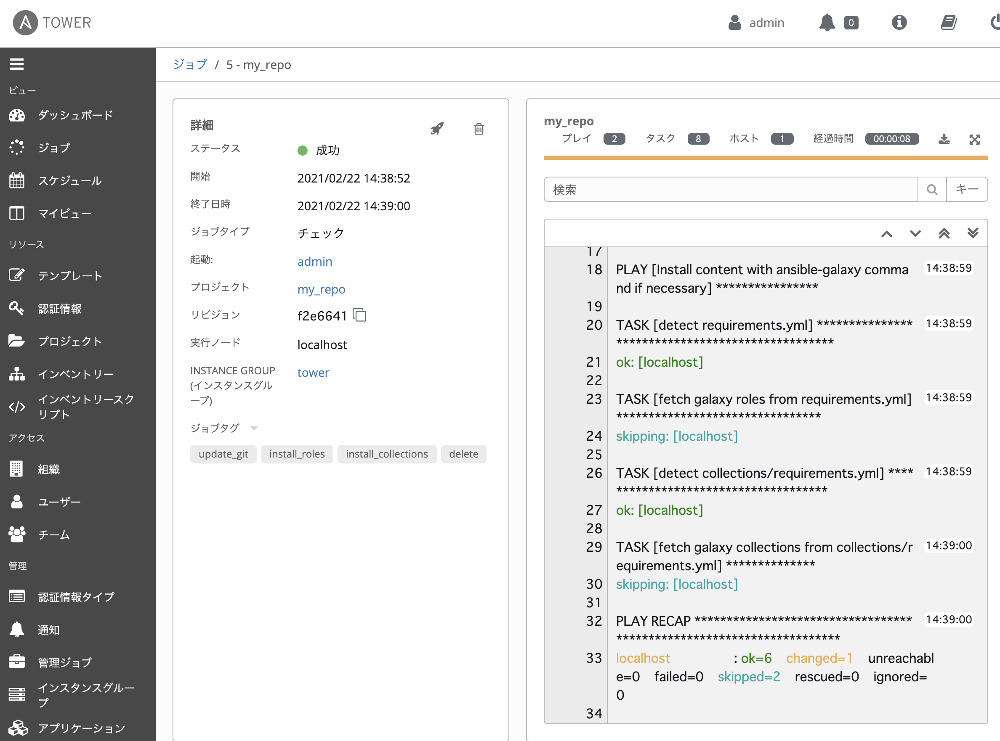
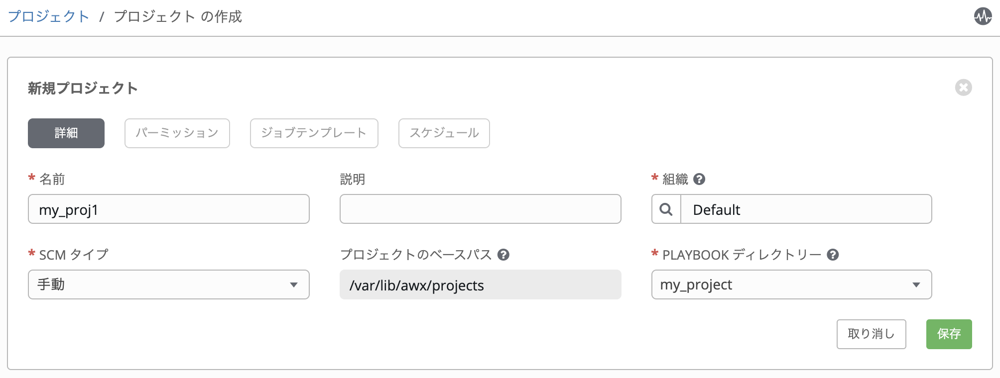

# 小さなボタンを作る

本ドキュメントは [Ansible Trail Map 牡丹山](https://www.redhat.com/ja/explore/ansible/trailmap) の一部となります。
構築した Red Hat Ansible Automation Platform で小さなボタンを作る方法について解説していきます。

## 準備するもの

本ステップを進める上で必要な環境は以下となります。

1. Red Hat Ansible Automation Platform 環境(step4 で準備)
2. ボタン化したいPlaybook
3. 自動化の対象となるテスト環境(サーバーやネットワーク機器)

>Note: 2については git 環境で管理されているとベストです。また git を使っていない場合はファイルとして Playbook を利用することも可能ですが、ぜひこれを機に git の利用を検討してください。

## ボタンを構成する要素

Red Hat Ansible Automation Platform ではボタンを構成するためには以下の3つを事前に設定する必要があります。

- Project（プロジェクト）・・・利用するPlaybookを登録する
- Inventory（インベントリー）・・・自動化の対象となるホストを登録する
- Credential（クレデンシャル）・・・認証情報を登録する

まずはこれらを Red Hat Ansible Automation Platform 上で作成していきます。

## プロジェクトの作成
プロジェクトには使用するPlaybookを登録します。大きく2つの方法があり「外部SCMと連携する」か「手動でファイルを登録する」になります。外部のSCMとの連携が最も一般的で、多くの場合で git が利用されます。ここでは git を例に手順を紹介し、最後に手動でのファイル登録を紹介します。

左メニューから「プロジェクト」を選択し、画面右側の「＋」ボタンを押すことでプロジェクトの追加が行えます。


### git 連携によるプロジェクト作成
git 連携を行う場合は、利用するPlaybookが git 上のリポジトリに格納されていることが前提となります。

#### git プロジェクトの作成
「名前」と「説明」を入力し、「SCMライプ」で「git」を選択するとリポジトリのURL入力のフォームが表示されます。ここに自分のリポジトリのURLを入力します。「SCMの更新オプション」にはサンプルのようにチェックを入れます。このオプションはTowerサーバー上にキャッシュされるリポジトリのデータを毎回クリーンな状態に保つます。最初はトラブルを避けるためにこのチェックを入れるのがお薦めです。
最後に「保存」を押すと設定が保存され、リポジトリの同期が行われます。



>Note: リポジトリのアクセスに認証が必要な場合は、先にリポジトリの認証情報を登録しておき、その認証情報を「SCM認証情報」にセットします。認証情報の作成は後述する「クレデンシャルの作成」を確認してください。

#### 同期の確認
プロジェクトを作成すると初回の同期が自動で開始されます。プロジェクトの横に緑マークがつけば同期に成功し、Playbookが利用可能な状態になります。



>Note: 同期がエラーとなった場合の対処
設定ミスや認証設定の問題でエラーとなる場合があります。その場合は左メニューの「ジョブ」からログを確認することが可能です。ここからエラーの原因を確認してください。




### 手動でファイルを登録してプロジェクト作成
git 等のSCMを使用しない場合は、手動でTowerサーバー上にPlaybookをアップロードして利用することが可能です。

#### ファイルをTowerサーバーへアップロード
まずTowerサーバーへファイルをアップロードします。

操作はAWXユーザーで行います。このユーザーはTowerのインストール時に自動的に作成されます。
```bash
[root@localhost ~]# su - awx

[awx@localhost ~]$ pwd
/var/lib/awx
```

Playbookは `/var/lib/awx/projects` にディレクトリを作成して格納します。
```bash
[awx@localhost ~]$ cd projects/
[awx@localhost projects]$ mkdir my_project
[awx@localhost projects]$ cd my_project/

[awx@localhost my_project]$ pwd
/var/lib/awx/projects/my_project

[awx@localhost my_project]$ cp my_playbook.yml .
```

>Note: 権限の設定
このとき、ディレクトリとPlaybookの権限は `awx:awx` に設定されている必要があります。root ユーザー等で操作したときは注意してください。
```
[awx@localhost ~]$ chown -R awx:awx ~/projects/my_project
```

#### ディレクトリをプロジェクトへ登録
PlaybookをアップロードしたディレクトリをTowerへ登録します。プロジェクトの作成からSCMタイプ「手動」を選択し、Playbookのディレクトリを選択して保存します。




## クレデンシャルの作成
クレデンシャルには様々な認証情報を登録します。登録された認証情報を使ってTowerは自動化の対象となる環境へログインを行います。ここに登録された認証情報のパスワードは登録した人でも内容を確認することができません。つまり、ユーザー名やパスワードを利用者や開発者に教えることなく自動化の開発や実行が行えるようになります。

### クレデンシャルの登録


